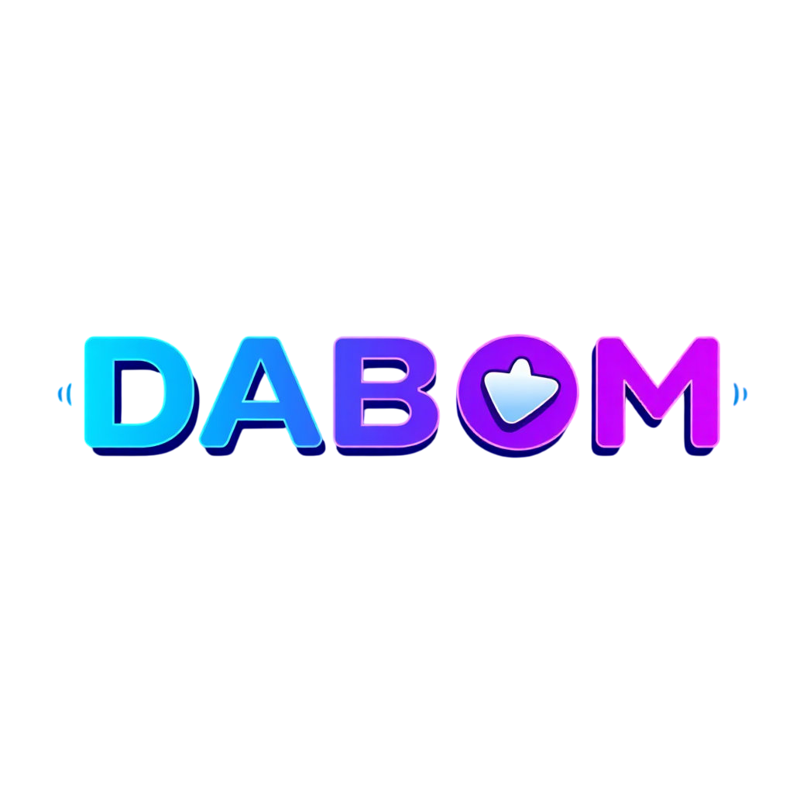
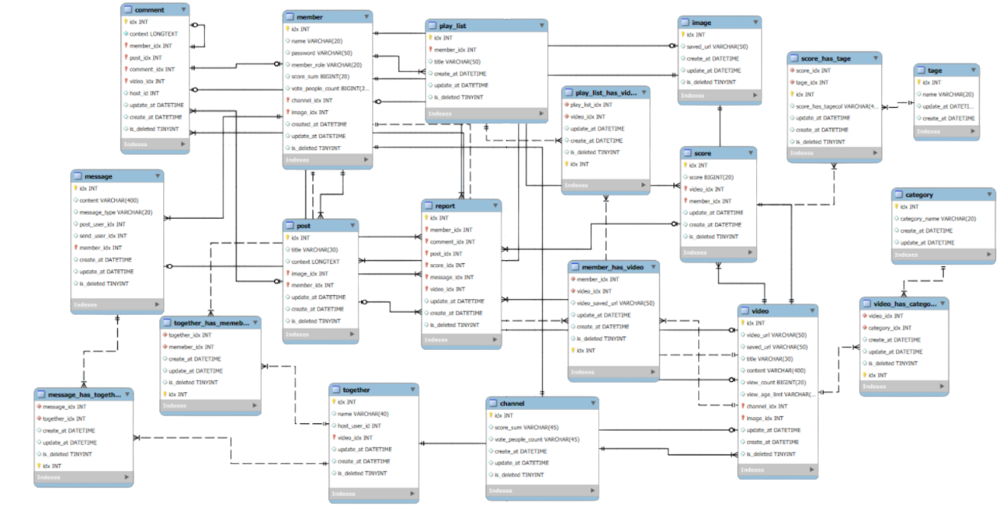
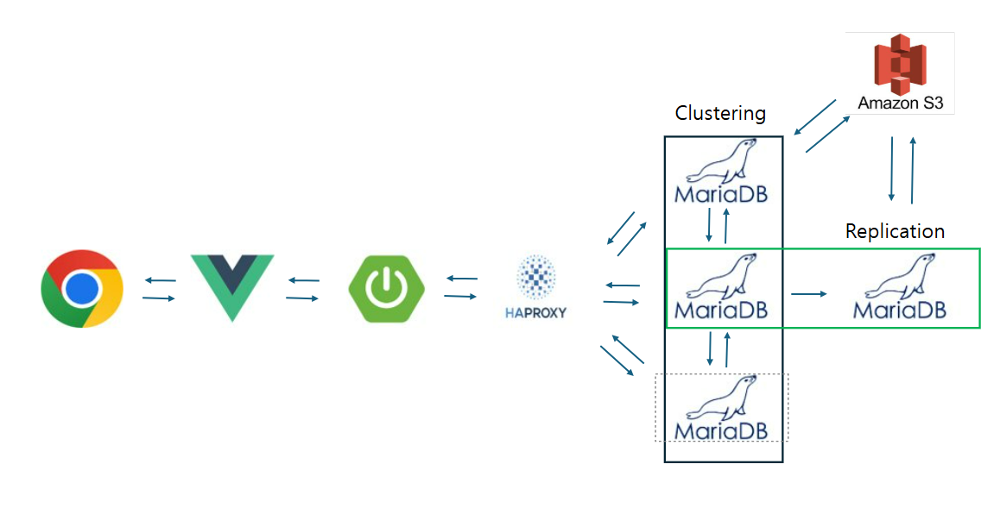
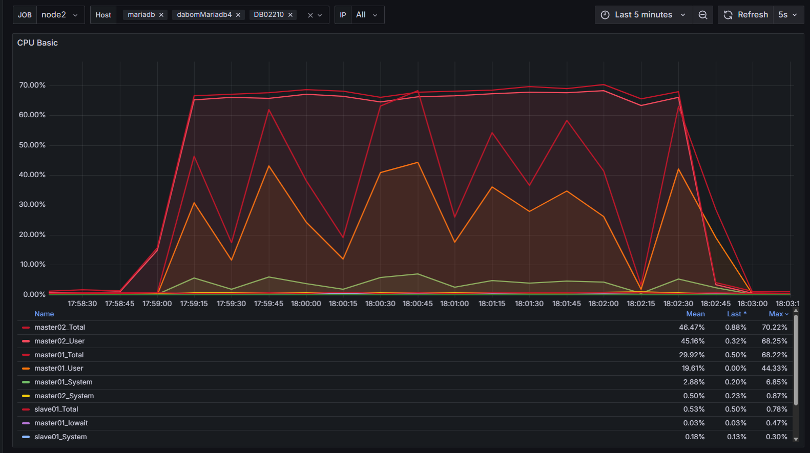
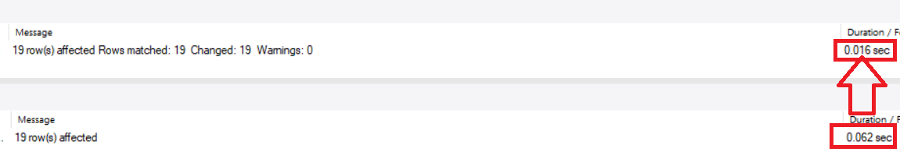

# be17-1st-FlowBox-DaBom
<h1 align="center" >DaBom  </h1>

  

 
 

<h1 align="center" >🌌 팀 FlowBox ▶️ </h1>

 

## 👨‍👩‍👧‍👦 팀원

🧑‍💻 **강병욱**

🧑‍💻 **김륜환**

🧑‍💻 **김성인**

🧑‍💻 **양형모**

🧑‍💻 **최민성**

 

# 📌 프로젝트 목표

 

**SNS와 영상 스트리밍 서비스가 합쳐진 새로운 패러다임의 서비스**

 

# 🔧 기술 스택
운영 환경  

DB  

모니터링  
 

협업 툴  
 

 

# 📮 프로젝트 기획안

## 📣 소 개

<b>영상 스트리밍을 중심으로 한 멀티 플랫폼 커뮤니케이션 서비스입니다. 
이를 통해 다봄은 기존 영상 스트리밍 서비스를 제공할 뿐만 아니라 영상에 대한 점수제와 채널 소유자와 소통이 하나로 통합된 사용자 경험을 제공하며, 기존 영상 플랫폼을 보완하는 대안을 제시합니다.
</b>

## 🖼️  배 경

 
 <b> 배경 설명 </b> 

   

>기존 영상 플랫폼은 ‘좋아요/싫어요’ 중심 평가로, 콘텐츠에 대한 정교한 피드백을 제공하기 어렵습니다.

>이에 1~5점의 별점 평가와 세부 항목 피드백 기능을 도입하여, 창작자와 시청자 모두에게 구체적인 정보를 제공하기 위해 시작되었습니다.

기존의 단순한 '좋아요/싫어요' 반응 방식에서 벗어나, 별점 기반의 정량적 평가 시스템을 도입하여 영상 콘텐츠에 대해 보다 세분화된 피드백을 제공합니다.

또한, 사용자는 시청 중심의 수동적인 콘텐츠 소비를 넘어, 창작자 및 다른 시청자들과의 실시간 상호작용(댓글, 대댓글, 채팅, 쪽지 등)을 경험할 수 있습니다.

사용자는 채널 개설, 영상 업로드, 실시간 스트리밍, 플레이리스트 구성, 평가 참여 등 다양한 방식으로 플랫폼에 참여할 수 있으며, 사용자의 개인 점수 및 프로필에 반영되어 지속적인 피드백 순환 구조 제공합니다.

**2-1 별점 기반 평가 시스템 도입**

> 최근에는 ‘썸네일 어그로’와 같이 콘텐츠 본질보다 클릭을 유도하는 요소가 과도하게 강조되는 사회적 문제가 발생하고 있습니다. 별점 시스템은 이러한 문제를 보완하고, 사용자가 영상의 실제 품질을 시각적으로 판단할 수 있는 기반을 제공합니다.

특히 이 시스템은 직관적인 사용자 경험을 제공한다는 점에서 강점이 있으며, 소비자는 영상의 정보성, 재미, 편집력 등 다양한 평가 항목을 바탕으로 더 나은 의사결정을 할 수 있습니다. 이는  콘텐츠 품질 향상과 플랫폼 신뢰도 제고로 이어질 수 있습니다.

**2-2 통합 커뮤니케이션 기능**

> 구독자와 창작자 간의 DM(쪽지) 기능을 제공하여, 별도의 SNS 없이도 직접적인 피드백과 소통이 가능합니다.

타 사이트는 댓글 외에는 크리에이터와 구독자 간에 1:1로 소통할 수 있는 수단이 존재하지 않아, 팬들과의 개인적인 교류나 피드백 전달이 어려운 구조입니다. 반면, SNS 플랫폼 같은 플랫폼은 DM(Direct Message) 기능을 통해 사용자 간의 자유로운 소통이 가능하며, 이를 통해 커뮤니티가 자연스럽게 강화되고 있습니다.

따라서 다봄은 쪽지(DM) 기능을 도입하여, Q&A, 피드백, 소통 요청, 팬 레터 등 다양한 목적으로 활용될 수 있어 사용자 경험을 크게 향상시킬 것으로 예상됩니다. 특히 구독자와 크리에이터 간의 관계를 보다 밀접하게 만들어 플랫폼 충성도를 높이는 데에도 긍정적인 역할을 할 것으로 기대됩니다.

## 📓  시나리오

 
 <b> 시나리오 펼쳐보기 </b> 

## 사용자  
> ##### 1-1. 회원가입
>- 유저는 회원가입을 할 수 있다.
>- 유저는 회원가입시 이메일 인증을 해야 한다.

> ##### 1-2. 로그인 및 계정 관리
>- 유저가 로그인을 할 수 있다.
>- 유저가 비밀번호를 수정할 수 있다.
>- 유저가 사용자 이름을 수정할 수 있다.

> ##### 1-3. 검색 기능
> - 유저는 영상 제목으로 영상을 검색할 수 있다.
> - 유저는 채널 제목으로 채널을 검색할 수 있다.
> - 유저는 태그로 영상을 검색할 수 있다.
> - 유저는 카테고리로 영상을 검색할 수 있다.
> - 유저는 플레이 리스트 이름으로 플레이 리스트를 검색할 수 있다. 

## 채널  
>##### 2-1. 채널 정보 관리
>- 유저가 채널 상태를 수정할 수 있다.
>- 유저가 채널 이름을 수정할 수 있다.
>- 유저가 채널 카테고리를 수정할 수 있다.
>- 유저가 채널 상세 설명서를 수정할 수 있다.

> ##### 2-2. 채널 구독 및 통계
>- 유저가 채널을 구독할 수 있다.
>- 유저가 구독한 채널을 확인하거나 구독을 취소할 수 있다.
>- 유저가 채널의 구독자 수를 확인할 수 있다.
>- 유저가 자신의 채널 구독자 수를 확인할 수 있다.
>- 유저가 채널을 구독자 수 순, 별점 순으로 검색할 수 있다.
>- 유저가 구독자 및 별점을 기준으로 세분화 검색할 수 있다.

> ##### 2-3. 채널 게시글
> - 유저가 채널에 게시글을 작성, 수정, 삭제할 수 있다.
> - 유저가 채널 게시글에 좋아요를 누를 수 있다.
> - 유저가 게시글에 댓글 및 대댓글을 작성할 수 있다.
> - 댓글/대댓글 수정 및 삭제, 좋아요 기능을 사용할 수 있다.

## 영상  

> ##### 3-1. 영상 업로드 및 수정
>- 유저가 영상을 업로드 할 수 있다.
>- 영상에 태그를 선택하고 시청 연령을 설정할 수 있다.
>- 영상에 대한 추가 설명을 첨부할 수 있다.
>- 유저가 업로드한 영상을 수정하거나 삭제할 수 있다.
>- 영상 수정 항목: 공개범위, 카테고리, 상태, 설명, 추가 링크 등

>##### 3-2. 영상 스트리밍 및 상호작용
>- 유저가 영상을 시청할 수 있다.
>- 영상에 좋아요/싫어요를 누를 수 있다.
>- 영상을 공유할 수 있다.
>- 영상을 시청하면서 채널을 구독할 수 있다.
>- 영상을 플레이리스트에 추가할 수 있다.
>- 영상 시청 완료 시 다음 영상 추천을 받을 수 있다.
>- 영상 시청 중 추천 영상의 썸네일을 볼 수 있다.

>##### 3-3. 영상 평가 및 통계
>- 유저가 영상에 별점을 매길 수 있다.
>- 유저가 매긴 별점을 수정할 수 있다.
>- 영상 별점과 별점을 준 유저 수를 확인할 수 있다.
>- 유저가 시청한 영상의 별점을 확인할 수 있다.
>- 채널은 자신의 영상의 조회수 통계를 확인할 수 있다.
>- 유저는 영상의 좋아요, 별점, 조회수 통계를 사전에 확인할 수 있다.

>##### 3-4. 영상 댓글 기능
>- 유저가 영상에 댓글/대댓글을 남길 수 있다.
>- 댓글에 좋아요/싫어요를 누를 수 있다.
>- 대댓글 작성 시 다른 유저를 태그할 수 있다.

## 4. 플레이리스트  

>##### 4-1. 플레이리스트 기능
> - 유저가 채널 영상들을 모아 플레이리스트를 작성할 수 있다.
> - 플레이리스트의 공개/비공개 여부를 설정할 수 있다.
> - 유저는 다른 유저가 공개한 플레이리스트를 확인하고 시청할 수 있다.

## 5. 쪽지  

>##### 5-1. 쪽지 기능
> - 유저가 채널에게 쪽지를 보낼 수 있다.
        - 한 채널에 하루 최대 5회 등 제한 사항 존재한다.
> - 채널은 사용자의 DM을 차단할 수 있다.
> - 채널은 수신된 쪽지의 요약본(욕설 필터링 포함)을 먼저 확인할 수 있다.
> - 유저는 채널이 쪽지를 읽었는지 여부를 확인할 수 있다.

## 6. Together 기능  

>##### 6-1. 신고 기능
> - 유저가 자신의 직접 Together 방을 신설할 수 있다.
> - 유저는 자신이 만든 Together 방으로 초대 코드를 만들어서 다른 유저를 초대할 수 있다.
> - 유저는 다른 유저가 만든 Together 방을 초대 코드를 이용해서 참여할 수 있다.
> - 유저들은 Togehter방에서 실시간 채팅에 참여할 수 있다.
> - Togther의 Host 유저는 Together 방에서 영상을 재생 시킬 수 있다.
> - Togther의 Host 유저는 Together 방에서 영상을 일시 정지 시킬 수 있다.
> - Togther의 Host 유저는 Together 방에서 영상을 종료 시킬 수 있다.
> - Togther의 Host 유저는 Together 방의 이름을 수정할 수 있다.

## 7. 신고 기능  

>##### 7-1. 신고 기능
> - 유저가 영상을 신고할 수 있다.
    - 유저는 자신이 신고한 영상을 볼 수 없다
> - 유저가 댓글을 신고할 수 있다.
        - 유저는 자신이 신고한 댓글을 볼 수 없다.
> - 유저가 유저를 신고할 수 있다.
        - 유저는 자신이 신고한 유저를 검색할 수 없다.

 

## 📃 요구사항 정의서
### 📑 <a href = "./doc/Dabom_요구사항_정의서.pdf"> 요구사항 정의서  </a>
 

## 📈 ERD

  

## 💻 시스템 아키텍처

  

 

## 🗄️ DDL

#### 📁<a href = "./db/DDL.sql"> DDL.sql   </a>

## 💡 성능 개선

 
<b>성능 개선 사례<b> 
  

<b>INDEX 적용 사례<b> 

### INDEX 적용 이유

> 채널 이름으로 검색하는 상황이 많음  
> mariaDB에서 varchar인 경우 "like '%test' 연산이 아닌 경우 B+tree로 탐색하는 것을 확인 
> Index가 없을 때, 매번 모든 노드를 탐색하고 있다는 것을 확인 
> 채널 이름에 Index를 걸어서 성능 향상을 기대함.

> Index 적용 전 쿼리문 실행시 실행시간 0.157 sec
 

  

> Index 적용 전 컴퓨터 부하 테스트

  

 

> index 적용 후 컴퓨터 부하 테스트

  

> Index 적용 후 일반 쿼리문 실행시 실행시간 0.063 sec

  

 
> 결과: 실행시간 약 0.1초 단축
 

 

<b>SOFT DELETE 적용 사례<b> 
  

### SOFT DELETE 적용 이유

> 테이블끼리 JOIN이 너무 많이 되어 DELETE시 실행 시간이 오래 걸린다는 것을 확인  
> 실제 실행시 SELECT 문과 비슷하게 성능이 나오는 것을 확인 
> 따라서 SOFT DELETE를 통해 일시적으로 검색이 안 나오게 끔 진행 
> 그 후, 사람들이 이용시간이 적은 시간에 한번에 삭제를 진행

  

> SOFT DELETE 적용하기 전 일반쿼리문 실행시 실행시간 0.062 sec

> SOFT DELETE 적용한 후 일반쿼리문 실행시 실행시간 0.016 sec

> 결과: 실행시간 약 0.06초 단축

