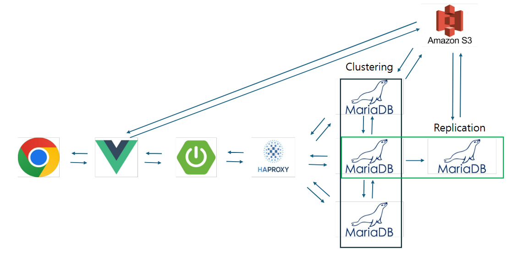
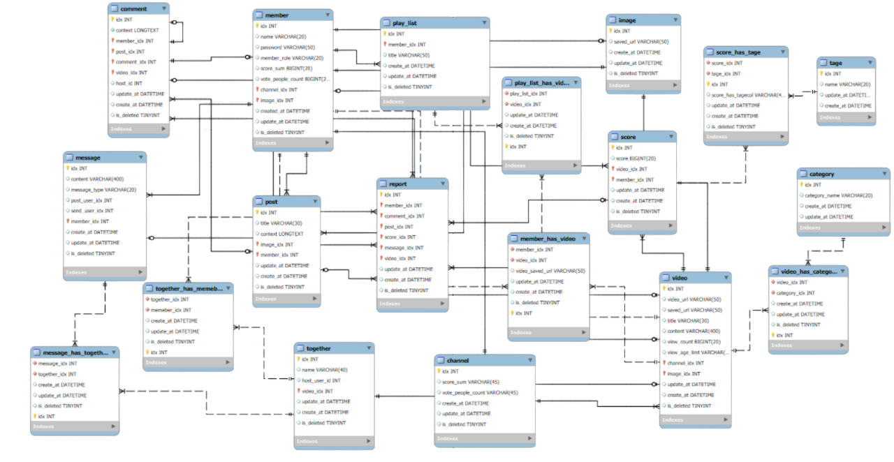
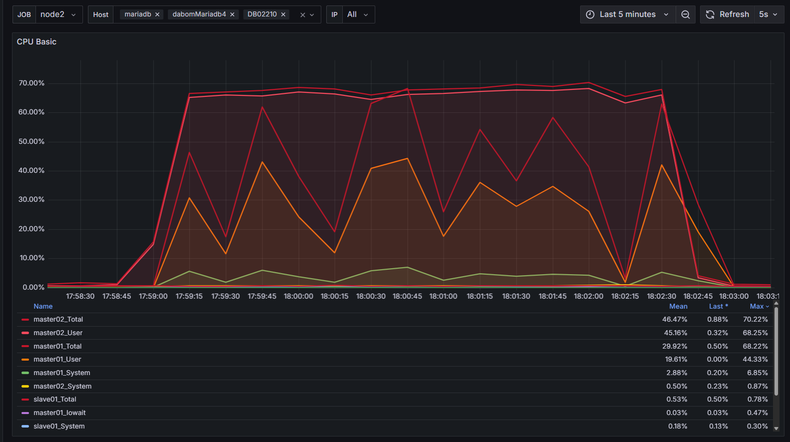
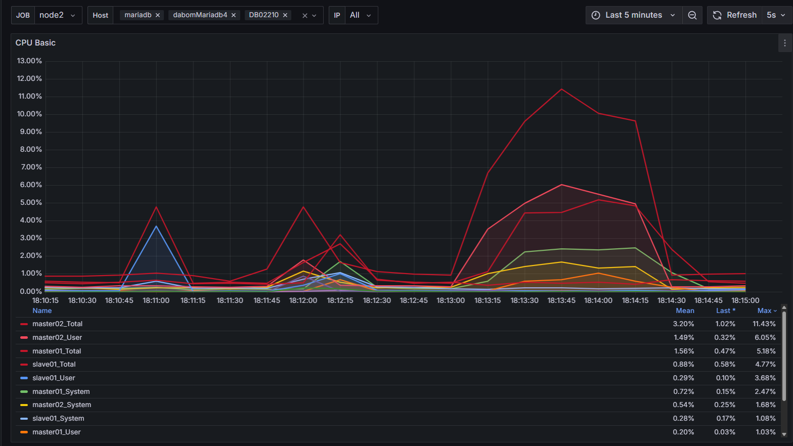
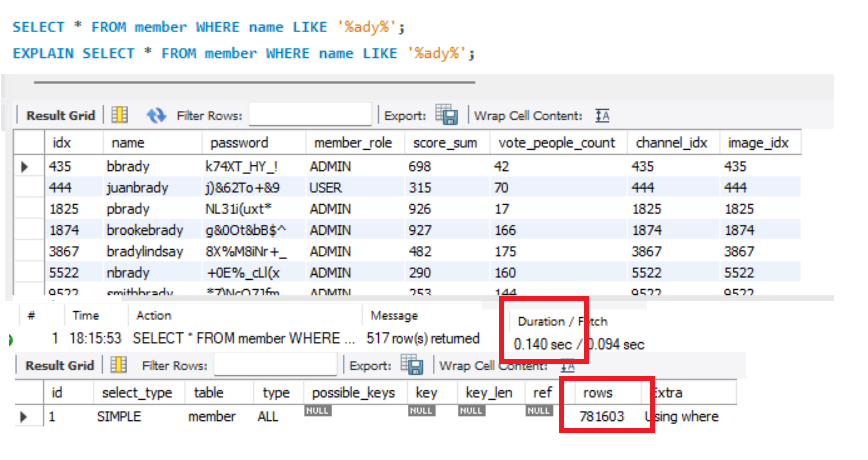
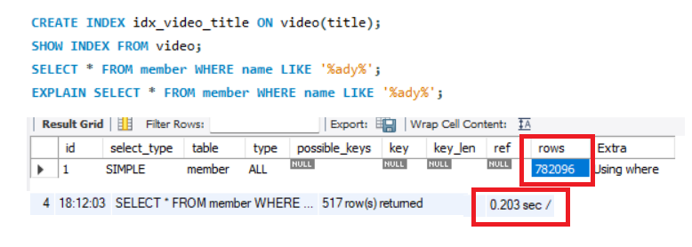
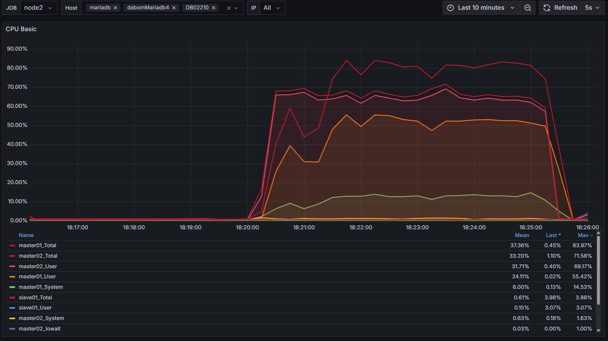

# 🎬 DaBom

### 영상 스트리밍을 중심으로 한 멀티 플랫폼 커뮤니케이션 서비스

---

## 🌌 Team FlowBox

## 👥 팀원 소개

<table align="center">
<tr>
<td align="center"><strong>🧑‍💻 강병욱</strong></td>
<td align="center"><strong>🧑‍💻 김륜환</strong></td>
<td align="center"><strong>🧑‍💻 김성인</strong></td>
<td align="center"><strong>🧑‍💻 양형모</strong></td>
<td align="center"><strong>🧑‍💻 최민성</strong></td>
</tr>
</table>

---

## 📋 목차

- [프로젝트 개요](#-프로젝트-개요)
- [주요 기능](#-주요-기능)
- [기술 스택](#️-기술-스택)
- [시스템 아키텍처](#-시스템-아키텍처)
- [데이터베이스 설계](#-데이터베이스-설계)
- [성능 최적화](#-성능-최적화)
- [문서](#-문서)

---

## 🎯 프로젝트 개요

> **SNS와 영상 스트리밍 서비스가 합쳐진 새로운 패러다임의 서비스**

DaBom은 기존 영상 플랫폼의 한계를 극복하고 창작자와 시청자 간의 소통을 강화하는 혁신적인 플랫폼입니다.

### ✨ 핵심 가치

- **🌟 별점 기반 평가 시스템**: 기존의 단순한 '좋아요/싫어요'를 넘어선 세분화된 평가
- **💬 통합 커뮤니케이션**: 창작자와 구독자 간의 직접적인 소통 채널 제공
- **🤝 실시간 상호작용**: Together 기능을 통한 동시 시청 및 채팅

---

## 🚀 주요 기능

| 기능 | 설명 | 상태 |
|:---:|:---|:---:|
| **별점 평가** | 1~5점 세분화된 영상 평가 시스템 | ✅ |
| **DM 시스템** | 창작자-구독자 간 직접 소통 | ✅ |
| **Together 모드** | 실시간 동시 시청 기능 | ✅ |
| **플레이리스트** | 개인화된 영상 컬렉션 | ✅ |
| **실시간 스트리밍** | 라이브 방송 및 채팅 | 🔄 |

---

## 🛠️ 기술 스택

### 🖥️ 운영 환경

### 🗄️ 데이터베이스

### 📊 모니터링

### 🤝 협업 도구

---

## 📚 프로젝트 배경

<strong>📖 프로젝트 기획 배경</strong>

### 🎯 문제 인식

> 기존 영상 플랫폼의 '좋아요/싫어요' 중심 평가 시스템으로는 콘텐츠에 대한 정교한 피드백을 제공하기 어렵습니다.

### 💡 해결 방안

**1️⃣ 별점 기반 평가 시스템**
- 1~5점의 세분화된 평가 시스템 도입
- '썸네일 어그로' 등의 문제 해결
- 콘텐츠 품질 향상 및 플랫폼 신뢰도 제고

**2️⃣ 통합 커뮤니케이션**
- 창작자-구독자 간 DM(쪽지) 기능
- Q&A, 피드백, 팬레터 등 다양한 활용
- 플랫폼 충성도 향상

<strong>🔍 상세 시나리오</strong>

### 👤 사용자 기능

#### 1️⃣ 계정 관리
- ✅ 회원가입 및 이메일 인증
- ✅ 로그인 및 프로필 관리
- ✅ 통합 검색 기능 (영상, 채널, 태그, 플레이리스트)

#### 2️⃣ 채널 관리
- ✅ 채널 정보 관리 및 구독 시스템
- ✅ 게시글 작성 및 댓글/대댓글 기능
- ✅ 구독자 통계 및 세분화 검색

#### 3️⃣ 영상 기능
- ✅ 영상 업로드 및 스트리밍
- ✅ 별점 평가 및 통계 확인
- ✅ 댓글 시스템 및 플레이리스트 관리

#### 4️⃣ 소셜 기능
- ✅ DM(쪽지) 시스템 (일일 제한 및 필터링)
- ✅ Together 기능 (실시간 동시 시청)
- ✅ 신고 시스템

---

## 💻 시스템 아키텍처

---

## 🗃️ 데이터베이스 설계

### 📋 DDL 스크립트
📁 **[DDL.sql](./db/DDL.sql)** - 데이터베이스 스키마 정의

---

## 📈 성능 최적화

<strong>⚡ 성능 개선 사례</strong>

### 🔍 INDEX 최적화

**적용 배경**
- 채널 이름 검색 빈도가 높음
- MariaDB varchar 컬럼의 B+tree 탐색 최적화 필요

**성과**
Before: 0.157 sec → After: 0.063 sec
⚡ 약 60% 성능 향상 (0.094초 단축)

**성과** Before: CPU 70% 부하 → After: CPU 12% 부하
⚡ 약 80% 성능 향상

### 🔍 PAGING 최적화

**적용 배경**
- 채널 이름 검색 빈도가 높음
- MariaDB varchar 컬럼의 INDEX인 경우 %%조회 시 사용 불가
- 따라서 PAGING을 통한 성능 개선 필요

- 위 사진처럼 row 탐색 수도 차이가 없고, 시간도 차이가 없음. 

- 따라서 PAGING을 통해서 성능 개선을 해야 한다.

### 🗑️ SOFT DELETE 구현

**적용 배경**
- 다중 테이블 JOIN으로 인한 DELETE 연산 지연
- 실시간 서비스에서의 응답성 개선 필요

**성과**
Before: 0.062 sec → After: 0.016 sec
⚡ 약 74% 성능 향상 (0.046초 단축)

---

## 📄 문서

### 📑 프로젝트 문서
- **[요구사항 정의서](./doc/Dabom_요구사항_정의서.pdf)** - 상세 기능 명세

---

### 🎉 Thank you for visiting DaBom!
